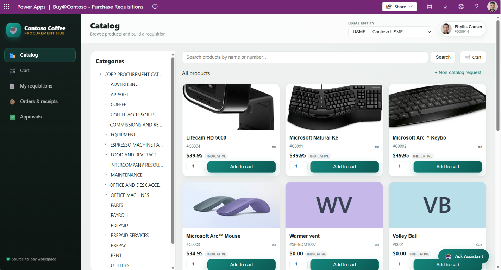
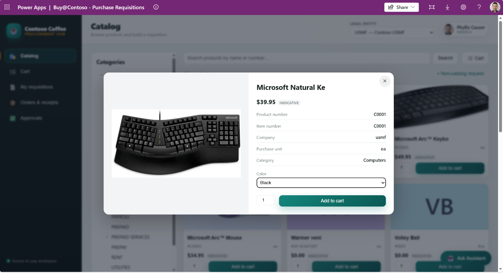
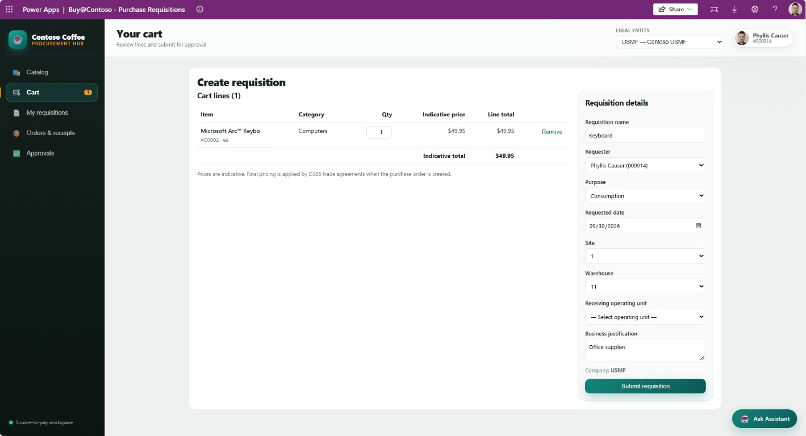
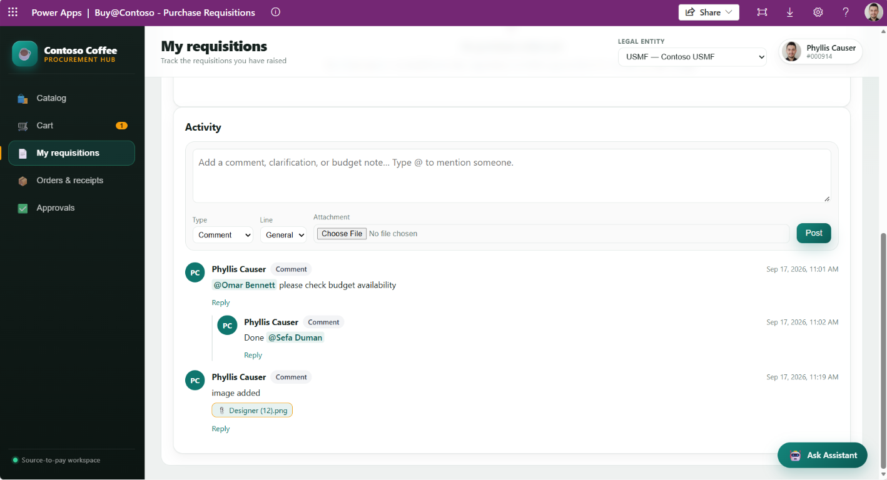
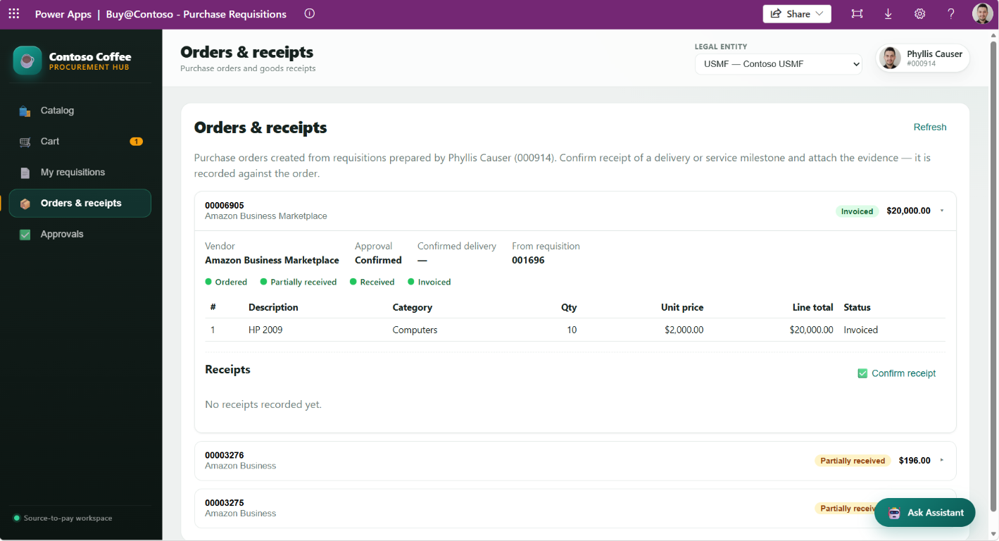
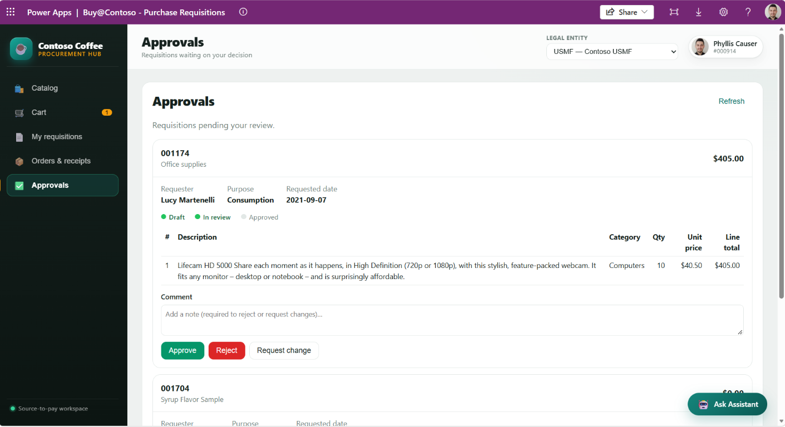

# Buy@Contoso

An internal procurement app for Contoso employees that replaces ad‑hoc Jira intake
with a guided, e‑commerce‑like experience. Built as a **Power Apps code app**
(React + TypeScript + Vite + the `@microsoft/power-apps` SDK) on top of
**Dynamics 365 Finance & Operations tables exposed as Dataverse virtual entities**.

Dynamics 365 F&O remains the system of record — the Dataverse virtual entities are
just the access surface. The demo legal entity is **USMF**.

## Screens

Buy@Contoso is organised as a **left-sidebar workspace** (Contoso Coffee — Procurement Hub) with five primary areas — Catalog, Cart, My requisitions, Orders & receipts, and Approvals — plus a product-detail dialog and a docked **Procurement Assistant** (Copilot Studio) that is reachable from every screen via the *Ask Assistant* button. A legal-entity switcher (default **USMF**) in the top bar scopes all data on every screen.

### 1. Catalog



The home screen — a guided, e-commerce-like way to browse what can be purchased.

- **Category tree (left):** the F&O procurement category hierarchy, read from `mserp_ecoresproductcategoryentities` and filtered to the procurement hierarchy role. Selecting a node scopes the product grid.
- **Product grid:** released products from `mserp_ecoresreleasedproductv2entities`, mapped to clean cards showing the product name, number, purchase unit (`ea`, `Box`, …), and an **INDICATIVE** price badge. Products without a resolved image fall back to a generated initials tile (e.g. `WV`, `VB`).
- **Search:** the search box queries by product name or number and re-renders the grid; paging is handled with OData skip-tokens.
- **Add to cart:** each card has a quantity stepper and an **Add to cart** button that pushes the line into the in-memory cart (React context in `state/AppState`) — nothing is written to Dataverse yet.
- **Non-catalog request:** `+ Non-catalog request` opens a free-text line for items that are not in the released-product catalog.

*Process:* Catalog → pick category / search → set quantity → **Add to cart**. Prices shown here are indicative only; the binding price is set by D365 trade agreements when the purchase order is created.

### 2. Product detail



Clicking a product card (or its title) opens a detail dialog for a closer look before adding it.

- **Specifications:** product number, item number, company, purchase unit, and category, mapped from the released-product record.
- **Product dimensions:** where the master defines them, **Color / Size / Configuration / Style** selectors are populated from the corresponding product-master entities (`mserp_ecoresproductmastercolor/size/configuration/style`). The chosen dimension travels with the cart line.
- **Add to cart:** the same quantity + **Add to cart** action as the grid, so the dialog is a drop-in replacement for the quick card action.

*Process:* Open product → choose dimensions (if any) → set quantity → **Add to cart** → close dialog and continue shopping.

### 3. Cart / Create requisition



The cart doubles as the requisition builder. Cart lines are on the left; the requisition header form is on the right.

- **Cart lines:** item, category, editable quantity, indicative unit price, line total, and a **Remove** action, with a running indicative total.
- **Requisition details:** requisition name, **Requester**, **Purpose** (Consumption / Replenishment), **Requested date**, **Site**, **Warehouse**, **Receiving operating unit**, and a **Business justification**. The company is fixed to the active legal entity (USMF).
- **Requester constraint:** F&O rejects a requisition whose preparer is not a current worker. `createRequisition` resolves and validates the personnel number against `mserp_hcmworkerentities` first and blocks submit with a clear message if it cannot be resolved (demo default `000001`).

*Process:* **Submit requisition** writes a header to `mserp_purchaserequisitionheaderv2entities` and one line per cart item to `mserp_purchaserequisitionlinev2entities`, each stamped with `buyinglegalentityid = USMF`. Purpose/status are remapped to the Dataverse option-set integers, and the user is routed to **My requisitions** with a confirmation flash showing the new requisition number.

### 4. My requisitions & collaboration



A list of the requisitions the current user has raised — each with status, total, lines, and an approval-progress indicator — and, when expanded, a full **Activity** collaboration thread.

- **Composer:** add a comment, clarification, or budget note. `Type @ to mention someone` triggers an inline people picker (resolved via the mention service against `mserp_dirperson*` / worker entities). A **Type** and **Line** selector scope the note (e.g. General vs. a specific line), and a file can be attached.
- **Threaded activity:** comments render as an avatar timeline with author, badge, timestamp, threaded **Reply**, @mention highlighting, and inline attachment chips (e.g. `Designer (12).png`).

*Process:* Comments, mentions, and attachments are persisted to a custom Dataverse table, `sd_requisitioncomment` (provisioned by `scripts/provision-requisitioncomment.ps1`), and are keyed back to the requisition (and optionally a line), so the conversation lives alongside the F&O requisition without changing the system of record.

### 5. Orders & receipts



Once a requisition converts to a purchase order in F&O, it appears here for the preparer to follow through delivery.

- **Order cards:** purchase orders from `mserp_purchpurchaseorderheaderv2entities` / `...linev2entities`, filtered to orders originating from the current user's requisitions. Each card shows the PO number, vendor, header amount, and a status pill (Ordered → **Partially received** → Received → **Invoiced**), plus the source requisition and confirmed-delivery state.
- **Lines:** description, category, quantity, unit price, line total, and per-line status.
- **Confirm receipt:** **Confirm receipt** records that a delivery or service milestone arrived and lets you attach the supporting evidence.

*Process:* A receipt is written to the custom `sd_goodsreceipt` table (provisioned by `scripts/provision-goodsreceipt.ps1`) recorded against the order/line, so goods-received confirmation and its evidence are captured in Dataverse and reflected in the order's progress.

### 6. Approvals



The approver's queue — requisitions that are waiting on the signed-in user's decision.

- **Queue cards:** each pending requisition shows its number, name, requester, purpose, requested date, a status progress indicator (Draft → **In review** → Approved), and the full line detail (description, category, quantity, unit price, line total).
- **Decision:** a **Comment** box (required to reject or request changes) with **Approve**, **Reject**, and **Request change** actions.

*Process:* `getPendingApprovals` loads requisitions in the *In review* state; `decideApproval` writes the chosen outcome back through the virtual entity (Approved / Rejected / change requested) together with the comment. Approval is workflow-driven in F&O, so any workflow restriction is surfaced to the user through centralised error handling.

### Procurement Assistant

Every screen carries an **Ask Assistant** button that opens a docked chat drawer backed by a **Microsoft Copilot Studio** agent (via the `microsoftcopilotstudio` connection). It gives users a conversational way to ask procurement questions without leaving the app.

## Architecture

```
src/
  models/            Clean app domain models (decoupled from generated types)
  services/          Typed service layer wrapping the generated Dataverse services
    catalogService   getCategoryTree / getProductsByCategory / searchProducts
    requisitionService  createRequisition / getMyRequisitions / getPendingApprovals / decideApproval
    workerService    getWorkers / resolveWorker (preparer constraint)
    imageResolver    Pluggable product image resolver (placeholder / CDN / map)
    config           Company scoping + option‑set (enum) value maps
    errors, paging   Centralised error handling + skipToken paging
  state/AppState     Cart + current‑company (USMF) + requester (React context)
  components/        CategoryTree + shared loading/empty/error UI
  screens/           Catalog / Cart / MyRequisitions / Approvals
  generated/         Auto‑generated Dataverse models + services (do not edit)
```

The UI imports only from `src/services` and `src/models` — it never touches the
generated `mserp_*` types directly. All reads/writes go through the generated
virtual‑entity services (no hand‑rolled OData/fetch).

## How the app maps to the connected Dataverse virtual entities

| Logical role | Dataverse virtual entity (entity set) | Generated service | Key fields used |
|---|---|---|---|
| Procurement category hierarchy | `mserp_ecoresproductcategoryentities` | `Mserp_ecoresproductcategoryentitiesService` | `mserp_categoryname`, `mserp_parentproductcategoryname`, `mserp_productcategoryhierarchyname` |
| Product → category assignment | `mserp_ecoresproductcategoryassignmententities` | `Mserp_ecoresproductcategoryassignmententitiesService` | `mserp_productnumber`, `mserp_productcategoryname`, `mserp_productcategoryhierarchyname` |
| Released products (catalog) | `mserp_ecoresreleasedproductv2entities` | `Mserp_ecoresreleasedproductv2entitiesService` | `mserp_productnumber`, `mserp_searchname`, `mserp_purchaseunitsymbol`, `mserp_purchaseprice` (indicative), `mserp_dataareaid` |
| Requisition header | `mserp_purchaserequisitionheaderv2entities` | `Mserp_purchaserequisitionheaderv2entitiesService` | `mserp_requisitionnumber/name/purpose/status`, `mserp_defaultbusinessjustificationdetails`, `mserp_defaultrequesteddate`, `mserp_preparerpersonnelnumber` |
| Requisition lines | `mserp_purchaserequisitionlinev2entities` | `Mserp_purchaserequisitionlinev2entitiesService` | `mserp_requisitionnumber`, `mserp_requisitionlinenumber`, `mserp_buyinglegalentityid`, `mserp_itemnumber`, `mserp_requestedpurchasequantity`, `mserp_purchaseprice` |
| Workers | `mserp_hcmworkerentities` | `Mserp_hcmworkerentitiesService` | `mserp_personnelnumber`, `mserp_name` |

### Notes and gotchas (handled in code)

- **Indicative pricing.** `mserp_purchaseprice` on released products is shown as
  *indicative only*. The final price is set by D365 trade agreements when the
  purchase order is created.
- **Enum / option‑set remapping.** The virtual entities surface F&O enums as
  Dataverse option‑set integers (not the raw F&O base values). These live in
  `src/services/config.ts`:
  - RequisitionPurpose: `Consumption = 200000000`, `Replenishment = 200000001`
  - RequisitionStatus: `Draft = 200000000`, `InReview = 200000001`,
    `Rejected = 200000002`, `Approved = 200000003`, …
- **Company scoping.** Product reads are filtered by `mserp_dataareaid eq 'USMF'`
  and each requisition line is stamped with `mserp_buyinglegalentityid = 'USMF'`
  (the header exposes no company field). Categories, assignments and workers are
  global.
- **Preparer must be a current worker.** F&O rejects a requisition if the preparer
  is not a current worker (“Preparer must be current worker”). `createRequisition`
  resolves and validates the personnel number against `mserp_hcmworkerentities`
  first (demo default `000001` Jodi Christiansen) and blocks submit with a clear
  message if it can't be resolved.
- **Approval is workflow‑driven.** `decideApproval` writes the status through the
  virtual entity to reflect intent; any F&O workflow restriction is surfaced to the
  user via centralised error handling.

## Connecting the data sources (`pac code add-data-source`)

All tables above are already connected as **Dataverse** data sources. To (re)add a
table, run — from the project root — the appropriate command. The `-t` value is the
Dataverse **table logical name**:

```powershell
pac code add-data-source -a dataverse -t mserp_ecoresproductcategoryentity
pac code add-data-source -a dataverse -t mserp_ecoresproductcategoryassignmententity
pac code add-data-source -a dataverse -t mserp_ecoresreleasedproductv2entity
pac code add-data-source -a dataverse -t mserp_purchaserequisitionheaderv2entity
pac code add-data-source -a dataverse -t mserp_purchaserequisitionlinev2entity
pac code add-data-source -a dataverse -t mserp_hcmworkerentity
```

Each command regenerates the typed models/services under `src/generated/` and
registers the data source in `power.config.json`.

## Product images

F&O product images are not exposed on the virtual entities, so the app resolves
images itself via a pluggable resolver (`src/services/imageResolver.ts`). The
default is an inline SVG placeholder. To override at bootstrap:

```ts
import { useCdnImageResolver, useImageMap } from './services';

useCdnImageResolver('https://cdn.example.com/products'); // <base>/<productNumber>.png
// or
useImageMap({ 'D0001': 'https://cdn.example.com/d0001.png' });
```

## Run locally

```powershell
npm install
copy power.config.example.json power.config.json   # then set appId + environmentId
pac code run
```

`pac code run` starts the Vite dev server and the Power Apps runtime so the
Dataverse virtual‑entity calls are authenticated against your environment.

> `power.config.json` holds your environment-specific `appId`/`environmentId`
> and is gitignored. Copy `power.config.example.json` to `power.config.json` and
> fill in your own values (or run `pac code init`) before running or pushing.

> Plain `npm run dev` will serve the UI, but data calls require the Power Apps
> runtime provided by `pac code run`.

## Build & push

```powershell
npm run build          # tsc + vite build -> ./dist
pac code push          # publish the code app to the Power Platform environment
```

## Tech stack

React 19 · TypeScript · Vite · `@microsoft/power-apps` SDK · Dataverse virtual
entities over Dynamics 365 F&O.
